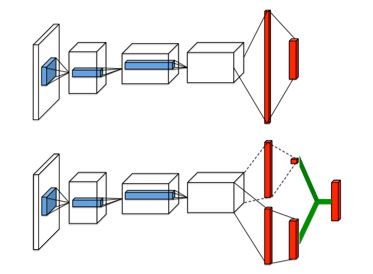

# dueling-DQN-pytorch
very easy implementation of dueling DQN in pytorch

all things are in one file, easily to follow~~



## requirement 

- tensorflow (for tensorboard logging)
- pytorch (>=1.0, 1.0.1 used in my experiment)
- gym
- [ViZDoom](https://github.com/mwydmuch/ViZDoom)


## CartPole-v0

just run 

```
python ddqn.py
```

common, no description~

in CartPole-v0 the network will convergence to 200 episode reward very quickly~~
## Visual doom

just run
```
python visual_doom.py
```

use the [basic](https://github.com/mwydmuch/ViZDoom/blob/master/examples/python/basic.py) environment of Visual doom. The agent could play very experienced after about 1000 times of games~~

## reference

[Dueling Network Architectures for Deep Reinforcement Learning (arxiv)](https://arxiv.org/abs/1511.06581)


